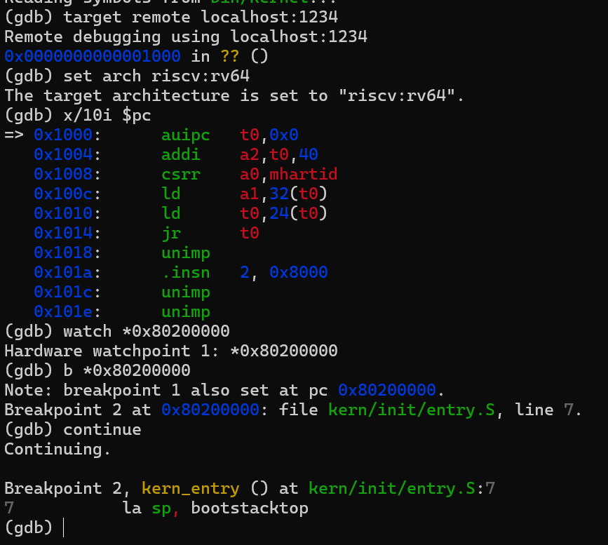
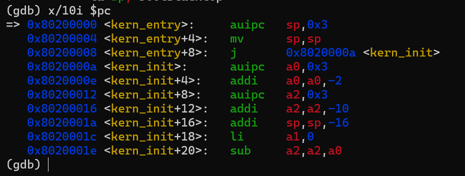

# 操作系统实验报告

## 实验基本信息

| 项目 | 内容 |
|------|------|
| **实验名称** | Lab 1: 最小可执行内核 |
| **小组成员** | 2412000-文玥、2413685-刘晟槿、2413978-缪承佑 |
| **完成日期** | 2026-10-DD |

### 小组分工

练习如何分工？

| 成员 | 负责的练习/模块 |
|------|----------------|
| 2412000-文玥 | [练习或模块名称] |
| 2413685-刘晟槿 | [练习或模块名称] |
| 2413978-缪承佑 | 练习1、练习2（共同）|

实验报告如何分工？

| 成员 | 负责的报告部分 |
|------|----------------|
| 2412000-文玥 | [报告相关部分] |
| 2413685-刘晟槿 | [报告相关部分] |
| 2413978-缪承佑 | 四、实验内容与实现；五、测试与验证 |
---

## 一、实验目的

本实验的主要目的是：

1. [目的1：]
2. [目的2：]
3. [目的3：]
4. [目的4：]

---

## 二、实验环境

| 成员 | AI 编程工具 | 底层模型 | 备注 |
|------|------------|---------|------|
| 2412000-文玥 | [例如：Cline（VS Code插件） / Claude Code（终端 Agent） / DeepSeek Harness等] | [例如：Claude Sonnet 4.5 / GPT-5.5 / DeepSeek-V4-Flash等] | [可选：特殊配置等] |
| 2413685-刘晟槿 | | | |
| 2413978-缪承佑 | DeepSeek Harness | DeepSeek-V4-Flash | |

**说明：**
- **AI 编程工具**：指具体使用的终端工具、编辑器插件、桌面应用或浏览器界面
- **底层模型**：指该工具使用的大语言模型及版本

---

## 三、实验整体逻辑分析

### 3.1 本章节的逻辑主线

[请用自己的话描述本章实验的核心主线，例如：
- 本章围绕哪个核心主题展开？（例如：用户进程管理、虚拟内存、文件系统等）
- 整个实验解决什么问题？（例如：如何让用户程序运行在操作系统之上）]

### 3.2 功能的逐步实现

[说明本章实验是按照什么顺序逐步实现各个功能的，以及为什么要按这个顺序，例如：

1. 首先实现**功能A** → 为什么首先实现这个？（例如：建立系统调用接口是后续所有用户态功能的基础）
2. 接着再完善**功能B** → 为什么接着实现这个？（例如：有了系统调用后，需要能够加载和启动第一个用户进程）
3. 然后完成**功能C** → 为什么然后实现这个？（例如：有了第一个进程后，需要实现进程复制功能）
4. 最后补充了**功能D** → 为什么最后实现这个？（例如：最后完善进程退出和清理机制，形成完整闭环）]

---

## 四、实验内容与实现

<!-- 
说明：本部分按照 exercises 文档中的练习顺序组织
每个功能模块或者练习中可能包含多项任务，请根据实际情况调整
-->

### 练习：练习1

**负责人：**  2413978-缪承佑

1.理解内核启动中的程序入口操作。
阅读 kern/init/entry.S 内容代码，结合操作系统内核启动流程，说明指令 la sp,
bootstacktop 完成了什么操作，目的是什么？tail kern_init 完成了什么操作，目的是什
么？

答：（1）指令 la sp,bootstacktop 完成的操作：la 是加载地址伪指令，把标签 bootstacktop
的内存地址加载到栈指针寄存器 sp。bootstacktop 是内核启动栈的栈顶地址。
（2）指令 la sp,bootstacktop 的目的：给内核设置启动栈。C 语言代码运行必须要有栈来
保存函数调用的栈帧、局部变量、返回地址。在跳转到 C 代码 kern_init 之前，先初始化栈
指针，保证后续 C 代码可以正常执行。
（3）指令 tail kern_init 完成的操作：tail 是 RISC-V 汇编跳转指令，属于尾跳转，跳转
到 kern_init 函数，不会返回（不保存返回地址到 ra 寄存器）。
（4）指令 tail kern_init 的目的：从汇编入口跳转到 C 语言编写的内核初始化函数
kern_init，正式进入内核 C 代码的初始化流程。内核启动到此不再返回 entry.S，所以用
tail 而不是普通的 jal。

---

### 练习：练习2

**负责人：**  2413685-刘晟槿、2413978-缪承佑

2.使用 GDB 验证启动流程。
为了熟悉使用 QEMU 和 GDB 的调试方法，请使用 GDB 跟踪 QEMU 模拟的 RISC-V 从加电开始，
直到执行内核第一条指令（跳转到 0x80200000）的整个过程。通过调试，请思考并回答：
RISC-V 硬件加电后最初执行的几条指令位于什么地址？它们主要完成了哪些功能？请在报
告中简要记录你的调试过程、观察结果和问题的答案。
tips：启动流程可以分为以下几个阶段：
1）CPU 从复位地址（0x1000）开始执行初始化固件（OpenSBI）的汇编代码，进行最基础的
硬件初始化。
2）SBI 固件进行主初始化，其核心任务之一是将内核加载到 0x80200000。可以使用 watch
*0x80200000 观察内核加载瞬间，避免单步跟踪大量代码。
3）SBI 最后跳转到 0x80200000，将控制权移交内核。使用 b *0x80200000 可在此中断，验
证内核开始执行。

调试过程：（1）在 WSL 终端启动 QEMU，开启 GDB 远程调试端口，CPU 暂停等待 GDB 连接：
qemu-system-riscv64 -machine virt -nographic -bios default \
  -device loader,file=bin/ucore.img,addr=0x80200000 -s -S
（2）新开终端，启动 riscv64-unknown-elf-gdb，执行连接命令，接入 QEMU 调试会话：
target remote localhost:1234
连接成功，当前 PC=0x1000，处于 CPU 复位状态。
（3）设置 RISC-V 64 位架构：
set arch riscv:rv64
（4）查看复位地址处最初 10 条汇编指令：
x/10i $pc
打印出 0x1000 开始的 OpenSBI 固件入口汇编代码。
（5）设置硬件观察点，监控内核加载地址写入事件：
watch *0x80200000
（6）在内核入口地址设置断点，捕获 SBI 跳转移交控制权：
b *0x80200000
（7）输入 continue 继续运行 CPU。程序执行，命中断点 0x80200000，暂停在内核入口
kern_entry。
（8）执行 x/10i $pc，查看内核入口处的第一条以及后续多条指令。
（9）记录指令信息，完成调试。

观察结果：（1）CPU 复位后，程序计数器 PC 初始为 0x1000，上电最先执行的指令就在地址
0x1000，输入 OpenSBI 固件。
（2）设置 watch *0x80200000 监控内存写入，b *0x80200000 设置断点。执行 continue 后，
程序最终在 0x80200000 断点停下，对应内核入口 kern_entry。
（3）地址 0x80200000 是内核第一条指令位置：auipc sp,0x3，内核入口标签 kern_entry，
接下来准备内核栈，然后跳转到 kern_init，正式进入内核初始化流程。
（4）整个流程：QEMU 启动时通过 -device loader 把内核镜像 bin/ucore.img 预加载到物理地址 0x80200000；CPU 上电后从复位地址 0x1000 开始执行 QEMU 内置的 OpenSBI（-bios default）固件；OpenSBI 完成底层硬件初始化后，跳转到 0x80200000，将 CPU 控制权交给操作系统内核。

问题答案：（1）最初执行的几条指令位于的地址：0x1000: auipc t0,0x0
                                         0x1004: addi a2,t0,40
                                         0x1008: csrr a0,mhartid
                                         0x100c: ld a1,32(t0)
                                         0x1010: ld t0,24(t0)
                                         0x1014: jr t0
（2）auipc t0,0x0 功能：以当前 PC 值为基准，构建基地址存入 t0；
addi a2,t0,40 功能：基地址加立即数 40，得到地址存入 a2；
csrr a0,mhartid 功能：读取 CSR 寄存器 mhartid，获取当前硬件核心 ID，保存到 a0；
ld a1,32(t0)、ld t0,24(t0)：从内存中加载数据，读取后续程序入口；
jr t0：跳转到 t0 保存的地址，进入 OpenSBI 后续初始化流程。

---

## 五、测试与验证

<!-- 根据该实验的具体情况，提供完整的测试运行截图，应包含：
- 编译及运行成功的输出（make qemu），可能有多个
- 测试通过的结果（make grade），只有一个
-->

**测试截图：**

---

## 六、实验总结与收获

### 对操作系统的理解

1. 列出你们认为本实验中重要的知识点，以及与对应的 OS 原理中的知识点，并简要说明二者的含义、关系和差异
2. 列出你们认为 OS 原理中很重要、但在本实验中没有对应上的知识点

### AI 协作开发的经验

[写出你们在与 AI 协作过程中实际收获的经验或者感悟]

---

