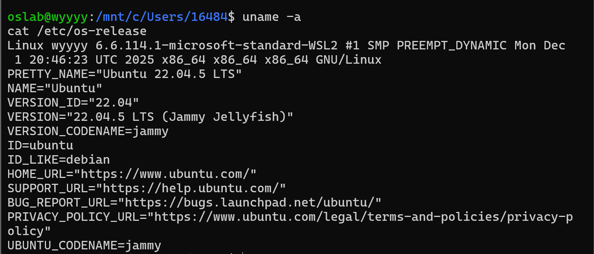
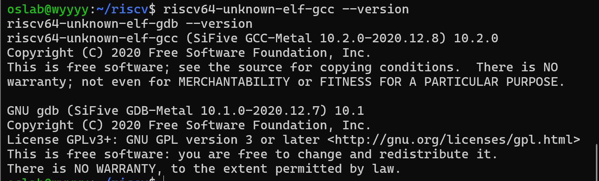
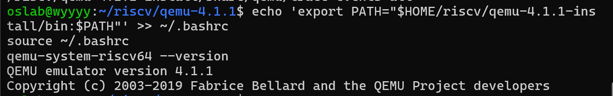
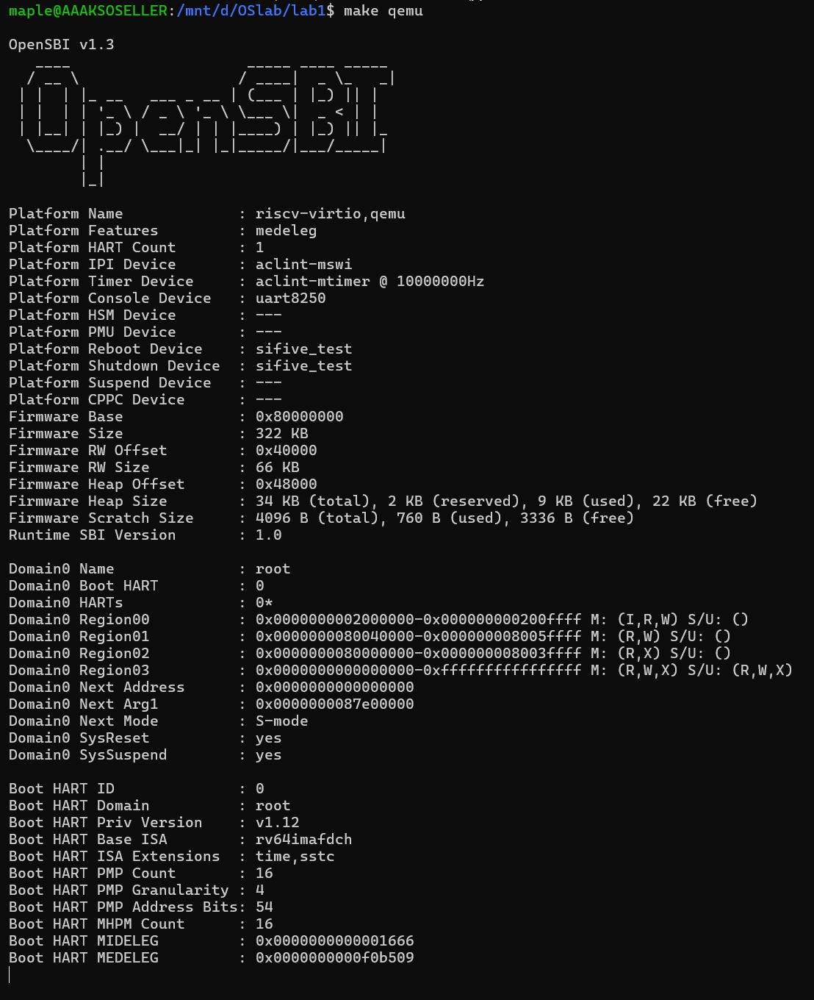
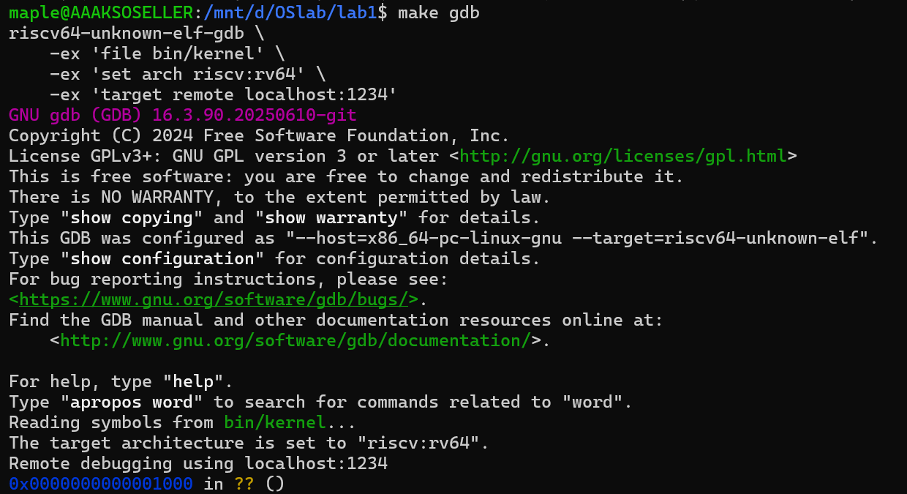
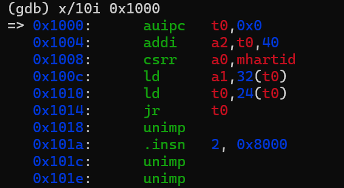
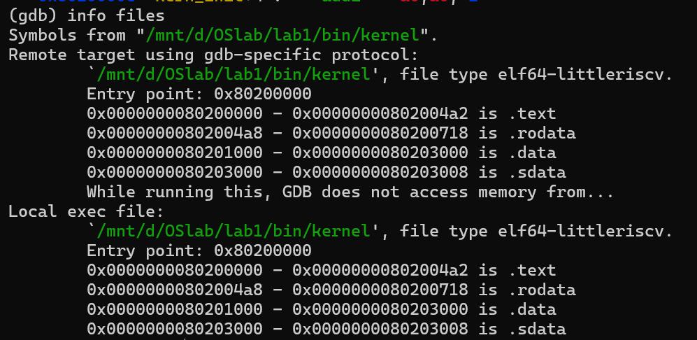

# 操作系统实验报告

## 实验基本信息

| 项目 | 内容 |
|------|------|
| **实验名称** | Lab 1 [最小可执行内核] |
| **小组成员** | 2412000-文玥、2413685-刘晟槿、2413978-缪承佑 |
| **完成日期** | 2026-10-07 |

### 小组分工

练习如何分工？

| 成员 | 负责的练习/模块 |
|------|----------------|
| 2412000-文玥 | 练习1、练习2（共同） |
| 2413685-刘晟槿 | 练习1、练习2（共同） |  |
| 2413978-缪承佑 | 练习1、练习2（共同）|

实验报告如何分工？


| 成员 | 负责的练习/模块 |
|------|----------------|
| 2412000-文玥 | 环境配置、交叉工具链与 QEMU 安装验证、内核编译运行 |
| 2413685-刘晟槿 |  实验目的、实验整体逻辑分析、启动流程与 GDB 调试|
| 2413978-缪承佑 | 练习1、练习2、内核源码与加载机制分析|

---

## 一、实验目的

本实验的主要目的是：

1. 使用 链接脚本 描述内存布局
2. 进行 交叉编译 生成可执行文件，进而生成内核镜像
3. 使用 OpenSBI 作为 bootloader 加载内核镜像，并使用 Qemu 进行模拟
4. 使用 OpenSBI 提供的服务，在屏幕上格式化打印字符串用于以后调试
---

## 二、实验环境

| 成员 | AI 编程工具 | 底层模型 | 备注 |
|------|------------|---------|------|
| 2412000-文玥 | Codex  |  GPT6-Astra| 用于环境排错、实验解释、调试指导和文档整理 |
| 2413685-刘晟槿 | | | |
| 2413978-缪承佑 | DeepSeek Harness | DeepSeek-V4-Flash | |

**说明：**
- **AI 编程工具**：指具体使用的终端工具、编辑器插件、桌面应用或浏览器界面
- **底层模型**：指该工具使用的大语言模型及版本

### 实验环境与复现步骤


#### 1. 实际环境

| 项目 | 本人使用的配置 / 实测输出 |
|------|-------------------------|
| 宿主环境 | Windows，使用 Windows Terminal 操作 WSL |
| Linux 发行版 | Ubuntu 22.04.5 LTS，WSL 2，x86_64 |
| Linux 内核 | 6.6.114.1-microsoft-standard-WSL2 |
| RISC-V 交叉编译器 | riscv64-unknown-elf-gcc，SiFive GCC-Metal 10.2.0-2020.12.8，GCC 10.2.0 |
| RISC-V 调试器 | riscv64-unknown-elf-gdb，SiFive GDB-Metal 10.1.0-2020.12.7，GDB 10.1 |
| 模拟器 | qemu-system-riscv64，QEMU 4.1.1 |


在 PowerShell 中安装 Ubuntu 的命令为：

```powershell
wsl --install -d Ubuntu-22.04
```

首次启动后完成 Linux 用户创建。之后在 Ubuntu 中检查环境：

```bash
uname -a
cat /etc/os-release
riscv64-unknown-elf-gcc --version
riscv64-unknown-elf-gdb --version
qemu-system-riscv64 --version
```

下面三张截图分别保留发行版、交叉工具链和 QEMU 的实测版本。







#### 2. 编译与运行

先将课程代码放入 Ubuntu 的 `~/os-labs/lab1/code`，确认该目录下有 `Makefile`、`kern`、`libs`、`tools`。在工具链与 QEMU 已加入 PATH 的前提下执行：

```bash
cd ~/os-labs/lab1/code
make
make qemu
```

本人实际观察到：`make` 完成汇编 / C 文件编译和链接，生成 `bin/kernel`；随后 `objcopy` 生成 `bin/ucore.img`。`make qemu` 启动后显示 OpenSBI 信息，并输出 `(THU.CST) os is loading ...`。编译与启动的同屏证据见第五部分的本人补充。

为复现后续远程调试，在两个 Ubuntu 标签页中分别进入同一代码目录：

```bash
# 终端一：让模拟 CPU 在启动时暂停，并提供 GDB 连接端口
cd ~/os-labs/lab1/code
make debug
```

```bash
# 终端二：加载内核符号并连接 QEMU
cd ~/os-labs/lab1/code
make gdb
```

上述调试命令应在结束前一次普通 QEMU 运行后执行。两个终端分别运行模拟器与调试器，不能在 `(gdb)` 提示符下输入 Linux 的 `make` 命令。

#### 3. 环境配置中的问题与处理记录

| 现象 | 本人的处理与验证 |
|------|------------------|
| WSL 首次安装时提示等待 OOBE，另有 localhost 代理提示 | 回到首次初始化流程，完成 Linux 账户创建；之后用 `uname -a` 和 `/etc/os-release` 确认可以进入 Ubuntu。代理提示本身不能作为安装失败的依据。 |
| 在 WSL 中使用 wget 下载 QEMU 源码时出现 Connection reset / SSL connection 错误 | 下载未成功时，后续解压和切换目录也失败。后来取得源码包并完成配置、编译、安装，最终以 `qemu-system-riscv64 --version` 显示 4.1.1 作为安装结果证据。 |
| 需要确认终端能找到正确的 QEMU | 将实际安装目录 `$HOME/riscv/qemu-4.1.1-install/bin` 加入 PATH，并重新加载 `~/.bashrc`；检查版本输出。 |
| 内核打印完成后不返回 shell 提示符 | 对照 `kern/init/init.c`，打印后执行 `while (1)`；在本实验中这是预期行为。 |

本人使用的是交叉编译器：工具本身运行在 x86_64 Linux 上，生成交给 QEMU 模拟的 RISC-V CPU 执行的代码。Ubuntu 环境安装成功、内核编译成功和内核运行成功是三个分别验证的步骤。

---

## 三、实验整体逻辑分析

### 3.1 本章节的逻辑主线

​	本实验围绕 **RISC-V 操作系统内核启动流程** 展开，主要目标是理解一个最小化操作系统内核从上电到开始运行的全过程。

​	整个实验解决的问题是：

- CPU 上电后如何开始执行第一条指令；
- OpenSBI 如何作为 Bootloader 完成硬件初始化和内核加载；
- 内核镜像如何通过链接脚本被放置到指定地址；
- 内核如何从汇编入口进入 C 语言环境；
- 操作系统在没有标准库支持的情况下如何实现输出功能。

​	通过本实验，可以完整理解从硬件启动、固件加载到操作系统内核运行的执行链路。

### 3.2 功能的逐步实现

### （1）确定内核内存布局

首先利用链接脚本 `tools/kernel.ld` 指定：

- 内核入口点为 `kern_entry`
- 内核加载地址为 `0x80200000`

这样 OpenSBI 才能够正确找到内核入口。

### （2）实现内核汇编入口

随后执行：

```asm
kern_entry:
    la sp, bootstacktop
    tail kern_init
```

完成：

- 初始化内核栈
- 建立 C 语言运行环境
- 跳转到 C 语言入口函数

这是进入高级语言环境的基础。

### （3）完成内核初始化

在 `kern_init()` 中：

```c
memset(edata, 0, end - edata);
```

清空 BSS 段。

随后：

```c
cprintf("(THU.CST) os is loading ...");
```

输出启动信息。

### （4）构建输出系统

由于内核不能使用 Linux 的标准库 `printf()`，

因此需要：

```
OpenSBI
 ↓
sbi_call()
 ↓
sbi_console_putchar()
 ↓
cons_putc()
 ↓
cputs()
 ↓
cprintf()
```

逐层封装实现格式化输出。

------

### （5）使用 QEMU 与 GDB 验证启动流程

最后通过：

```bash
make debug
make gdb
```

观察：

```bash
0x1000
 ↓
0x80000000
 ↓
0x80200000
```

的完整执行过程。

从而验证 OpenSBI 成功加载并启动内核。


---

## 四、实验内容与实现

### 练习1：理解内核启动中的程序入口操作

阅读 `kern/init/entry.S`内容代码，结合操作系统内核启动流程，

**问题1-**说明：`la sp, bootstacktop`完成了什么操作？目的是什么？


`sp` 是 RISC-V 的栈指针寄存器（Stack Pointer）。

在 `entry.S` 中定义了内核栈：

```
bootstack:
    .space KSTACKSIZE

bootstacktop:
```

其中：

```
bootstack
↓
-----------------
|               |
|    stack      |
|               |
-----------------
↑
bootstacktop
```

由于栈从高地址向低地址增长，因此栈顶应设置为：bootstacktop

指令`la sp, bootstacktop`的作用是：将 bootstacktop 的地址加载到 sp 寄存器中

执行后：`sp = bootstacktop`

目的：建立内核栈环境。

因为

- 函数调用需要栈
- 局部变量需要栈
- 保存返回地址需要栈

如果不初始化栈指针，后续执行 C 函数将发生错误。

因此该指令完成了：内核启动阶段的栈初始化。

------

**问题2**说明：`tail kern_init`完成了什么操作？目的是什么？

`tail` 是 RISC-V 的尾调用（Tail Call）伪指令。

等价于：

```
jalr x0, kern_init
```

特点：不保存返回地址、直接跳转

执行后：`PC → kern_init`

CPU 开始执行：`kern_init()`

目的：实现从汇编入口进入 C 语言内核入口由于内核启动后不会再返回 `kern_entry`，因此无需保存返回地址。使用尾调用更加高效。

------

#### 练习1总结

`la sp, bootstacktop`负责建立内核栈；

`tail kern_init`负责将执行流从汇编代码转入 C 语言内核入口。

二者共同完成了从硬件启动到内核初始化的关键过渡。

### 练习2: 使用GDB验证启动流程

为了熟悉使用 QEMU 和 GDB 的调试方法，请使用 GDB 跟踪 QEMU 模拟的 RISC-V 从加电开始，直到执行内核第一条指令（跳转到 0x80200000）的整个过程。通过调试，请思考并回答：RISC-V 硬件加电后最初执行的几条指令位于什么地址？它们主要完成了哪些功能？请在报告中简要记录你的调试过程、观察结果和问题的答案。

#### 调试过程

##### 1. 启动 QEMU

终端1：

```
make debug
```

QEMU 以暂停状态启动并等待 GDB 连接。

------

##### 2. 启动 GDB

终端2：

```
make gdb
```

连接成功后：

```
Remote debugging using localhost:1234
0x0000000000001000 in ?? ()
```

说明 CPU 当前位于：

```
PC = 0x1000
```

即复位地址。

------

##### 3. 查看复位地址指令

执行：

```
x/10i 0x1000
```

得到：

```
0x1000: auipc t0,0x0
0x1004: addi a2,t0,40
0x1008: csrr a0,mhartid
0x100c: ld a1,32(t0)
0x1010: ld t0,24(t0)
0x1014: jr t0
```

------

##### 4. 在内核入口设置断点

执行：

```
b *0x80200000
```

GDB显示：

```
Breakpoint 1 at 0x80200000
```

说明内核入口地址正确。

------

##### 5. 验证内核入口

查看：

```
x/5i 0x80200000
```

得到：

```
0x80200000 <kern_entry>: auipc sp,0x3
0x80200004 <kern_entry+4>: mv sp,sp
0x80200008 <kern_entry+8>: j 0x8020000a <kern_init>
```

说明：

```
0x80200000
```

确实为内核入口位置。

------

#### 问题回答

RISC-V 加电后最初执行的指令位于什么地址？

根据 GDB 调试结果：`PC = 0x1000`

因此：RISC-V 加电后首先执行位于 0x1000 的 MROM（Machine ROM）代码。

------

最初几条指令完成什么功能？

观察：

```
auipc t0,0x0
addi a2,t0,40
csrr a0,mhartid
ld a1,32(t0)
ld t0,24(t0)
jr t0
```

其主要功能包括：

1. 获取当前代码位置；
2. 获取当前 Hart ID；
3. 读取 OpenSBI 启动参数；
4. 计算 OpenSBI 入口地址；
5. 跳转到 OpenSBI。

最终执行流：

```
0x1000 (MROM)
    ↓
0x80000000 (OpenSBI)
    ↓
0x80200000 (Kernel)
```
## 测试与验证


**测试截图：**



> 从图1中OpenSBI启动信息可以看出，QEMU已经成功创建RISC-V virt机器，并加载OpenSBI固件，说明实验环境配置正确。



> 图2展示了GDB成功连接QEMU后，CPU停留在复位地址0x1000处。



> 图3对应了练习2——观察RISC-V加电后执行的第一批指令。



> 图4同时证明了内核入口地址、ELF布局、链接脚本生效。


---

## 六、实验总结与收获


##### 1. 系统启动流程

本实验从系统启动开始分析，理解了操作系统从被加载到开始运行的全过程。QEMU首先模拟硬件环境，随后加载OpenSBI固件。OpenSBI运行在RISC-V的M模式（Machine Mode）下，完成底层硬件初始化后，将控制权移交给运行在S模式（Supervisor Mode）下的uCore内核。

对应的操作系统原理是操作系统的引导过程（Bootstrapping）。实验中展示了一个简化的启动链路，而实际计算机中通常还会经历BIOS/UEFI、BootLoader等多个阶段，但其核心思想都是逐级建立运行环境并最终启动操作系统内核。

##### 2. 特权级与权限管理

实验中接触到了RISC-V体系结构中的M模式和S模式，并学习了OpenSBI与内核之间的关系。OpenSBI运行在更高权限级别，而uCore运行在较低权限级别，需要通过特定机制访问底层服务。

对应的操作系统原理是处理器特权级机制。现代操作系统通过硬件提供的权限隔离机制实现系统安全，防止普通程序直接访问硬件资源。本实验展示了内核与固件之间的权限切换过程，为后续学习用户态与内核态切换奠定了基础。

##### 3. SBI调用机制

实验中通过分析sbi_call函数，理解了内核如何使用ecall指令向OpenSBI请求服务。例如字符输出功能就是通过SBI_CONSOLE_PUTCHAR实现的。

对应的操作系统原理是系统调用机制。实验中的S模式调用M模式，与后续实验中用户态调用内核态具有相似的思想，都是通过受控的异常陷入机制实现不同权限级别之间的交互。

##### 4. 操作系统输出系统的构建

实验中学习了从最底层字符输出接口逐步构建高级输出函数的过程：

OpenSBI → sbi_console_putchar → cons_putc → cputchar → cputs → cprintf

这种逐层封装的设计体现了软件工程中的抽象思想。

对应的操作系统原理是设备驱动与I/O子系统。虽然本实验仅实现了最简单的字符输出功能，但已经展示了操作系统如何通过驱动程序屏蔽硬件细节，并向上层提供统一接口。

##### 5. Makefile自动化构建

实验中学习了Makefile的基本结构和依赖关系，理解了如何利用make命令自动完成编译、链接、镜像生成以及QEMU启动等工作。

对应的操作系统原理是大型软件工程的构建管理。操作系统通常由数千甚至数百万行代码组成，自动化构建系统是操作系统开发的重要组成部分。

##### 6. GDB内核调试

实验中使用GDB连接QEMU提供的调试接口，对内核入口地址进行断点设置，并查看寄存器和指令执行情况。

对应的操作系统原理是内核调试技术。由于内核运行在硬件底层，普通调试方法难以适用，因此远程调试和底层寄存器分析成为操作系统开发的重要手段。

